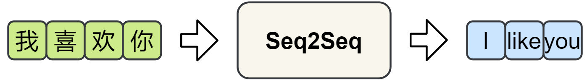
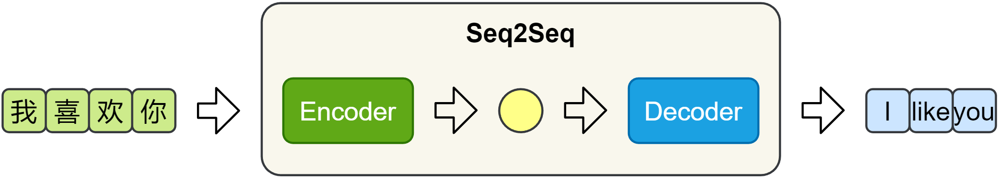
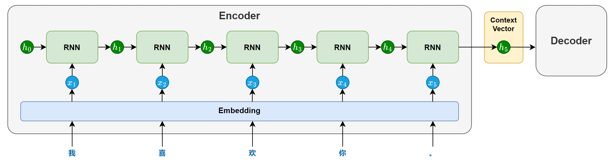
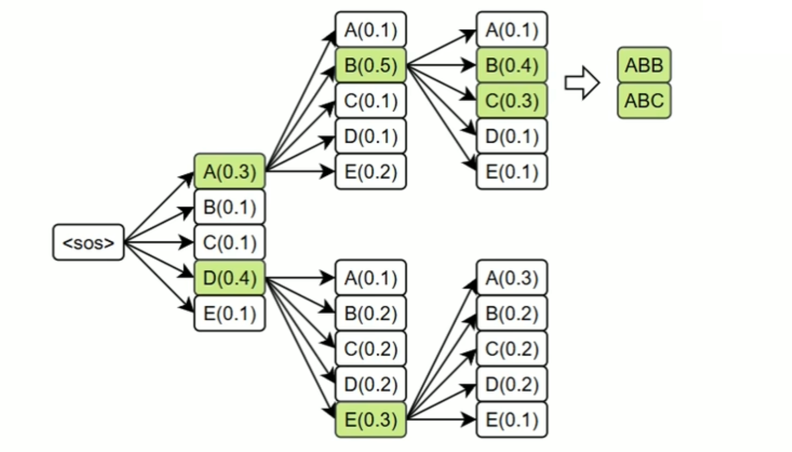

# Seq2Seq 模型

---

传统的自然语言处理任务（如文本分类、序列标注）以静态输出为主，其目标是预测固定类别或标签。然而，现实中的许多应用需要模型动态生成新的序列，例如：

- 机器翻译：输入中文句子，输出对应的英文翻译。 
- 文本摘要：输入长篇文章，生成简短的摘要。 
- 问答系统：输入用户问题，生成自然语言回答。
- 对话系统：输入对话历史，生成连贯的下一条回复。

这些任务具有两个关键共同点：

- 输入和输出均为序列（如词、字符或子词序列）。
- 输入与输出序列长度动态可变（例如翻译任务中，中英文句子长度可能不同）。

为了解决这类问题，研究者提出了Seq2Seq（Sequence to Sequence，序列到序列）模型。

---

# 一、Seq2Seq 模型结构

Seq2Seq 模型由一个编码器（Encoder）和一个解码器（Decoder）构成。编码器负责提取输入序列的语义信息，并将其压缩为一个固定长度的上下文向量（Context Vector）；解码器则基于该向量，逐步生成目标序列。

## 1.编码器（Encoder）

编码器主要由一个循环神经网络（RNN/LSTM/GRU）构成，其任务是将输入序列的语义信息提取并压缩为一个上下文向量。

在模型处理输入序列时，循环神经网络会依次接收每个token的输入，并在每个时间步步更新隐藏状态。每个隐藏状态都携带了截止到当前位置为止的信息。随着序列推进，信息不断累积，最终会在最后一个时间步形成一个包含整句信息的隐藏状态。

这个最后的隐藏状态就会作为上下文向量（context vector），传递给解码器，用于指导后续的序列生成。

为增强编码器的理解能力，循环网络也可以采用双向结构（结合前文与后文信息）或多层结构（提取更深的语义特征）。

## 2.解码器（Decoder）

解码器主要也由一个循环神经网络（RNN / LSTM / GRU）构成，其任务是基于编码器传递的上下文向量，逐步生成目标序列。

在生成开始时，循环神经网络以上下文向量作为初始隐藏状态，并接收一个特殊的起始标记 `<sos>`（start of sentence）作为第一个时间步的输入，用于预测第一个 token。

随后，在每一个时间步，模型都会根据前一时刻的隐藏状态和上一步生成的 token，预测当前的输出。这种“将前一步的输出作为下一步输入”的方式被称为自回归生成（Autoregressive Generation），它确保了生成结果的连贯性。

生成过程会持续进行，直到模型生成了一个特殊的结束标记 `<eos>`（end of sentence），表示句子生成完成。

说明：起始标记和结束标记会在训练数据中显式添加，模型会在训练中学会何时开始、如何续写，以及何时结束，从而掌握完整的生成流程。

## 3.训练机制

## 4.推理机制

#### 贪心解码（Greedy Decoding）

#### 束搜索（Beam Search）

每一步保留多个候选词序列（如 beam size = 3），并在扩展后选择得分最高的完整句子。

---

