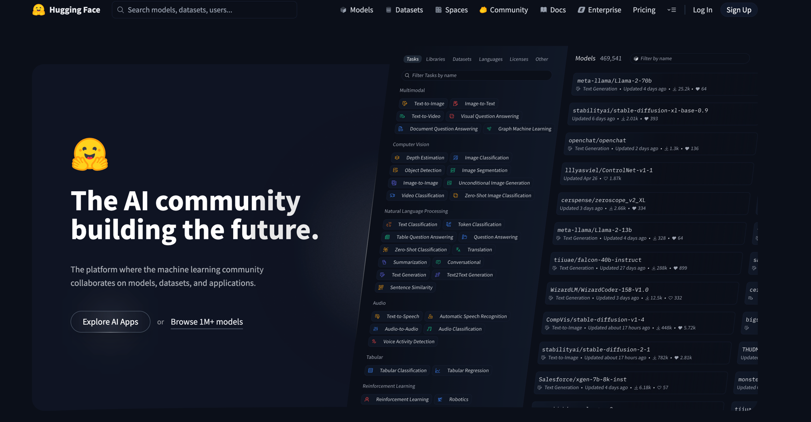

# HuggingFace 

---

官方站点：https://huggingface.co/

国内镜像站点：https://hf-mirror.com/




## 一、预训练模型加载与使用

### 1.模型加载详解

#### (1) AutoModel 系列

```python
from transformers import AutoTokenizer, AutoModelForMaskedLM

if __name__ == '__main__':
    # 使用cache_dir指定下载的模型缓存目录
    tokenizer = AutoTokenizer.from_pretrained("google-bert/bert-base-chinese", cache_dir='./llm-study/Transformer/model/')
    model = AutoModelForMaskedLM.from_pretrained("google-bert/bert-base-chinese", cache_dir='./llm-study/Transformer/model/')
```

#### (2) AutoModelForXXX 系列

```python

```


## 二、Tokenizer

### (1) 加载 Tokenizer


### (2) 使用 Tokenizer


## 三、Datasets


---

## 四、案例实操

基于预训练 Bert 模型实现情感分析任务


