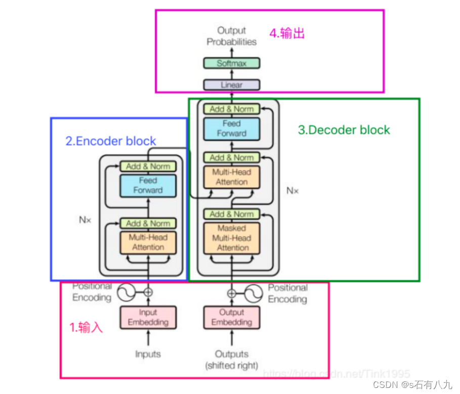
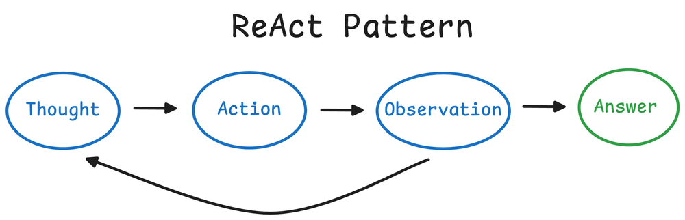
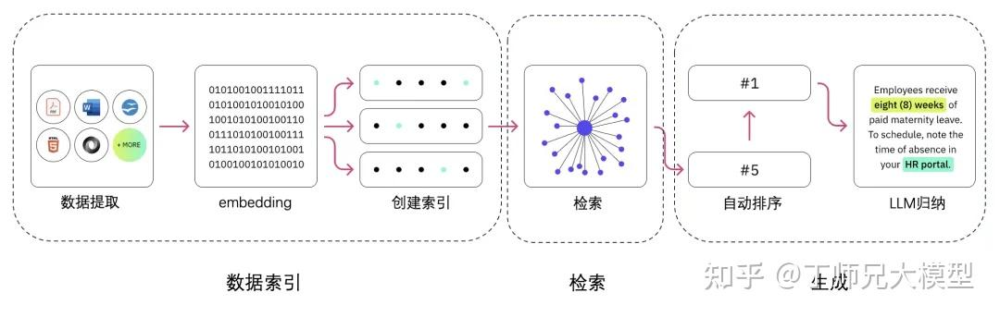

# LLM 应用开发面试题

---

## AI 应用开发 一面

面试流程：先进行自我介绍，实习经历介绍，项目介绍（项目中遇到的难点问题、如何进行解决的、取得了什么效果）

算法题：一道 medium、一道 easy（或者medium-第一题答上来就继续medium；回答不上来则给道easy）

设计模式：生产者消费者模式、

---

### CNN 卷积神经网络

#### 1.解释CNN的基本架构

卷积神经网络（CNN）是深度学习中用于处理图像数据的一类神经网络，它的基本架构包含几个核心层：

- 卷积层（Convolutional Layer） ：是CNN的基础，主要负责对输入图像进行特征提取。通过卷积操作，使用多个过滤器（或称为卷积核）扫描输入图像，提取出局部特征，并生成多个特征映射（feature maps）。
- 激活层（Activation Layer） ：通常紧随卷积层之后，引入非线性激活函数（如ReLU）处理卷积层的输出。这一步是必要的，因为线性操作的叠加仍然是线性的，而非线性激活函数能够帮助网络捕捉复杂的特征。
- 池化层（Pooling Layer） ：用于减少特征映射的维度，降低过拟合的风险，并减少计算量。最常见的池化操作是最大池化（Max Pooling），它从特征映射的一个小窗口中选取最大值作为该窗口的代表。
- 全连接层（Fully Connected Layer） ：在CNN的最后几层通常会有全连接层，它将前面层的输出“拉直”后，作为这一层的输入。全连接层的任务是基于特征映射进行分类或回归分析。

通过这些层的堆叠，CNN能够从简单到复杂逐步提取图像中的特征，最终实现图像分类、目标检测等任务。

---

#### 2.卷积层在CNN中的作用是什么？

卷积层是CNN中最重要的组成部分，它通过卷积操作对输入图像进行特征提取，具体作用如下：

- 局部感知 ：每个卷积核仅覆盖输入图像的一小部分区域（局部），使网络能够捕捉到局部特征（如边缘、角点、纹理等）。通过这种方式，CNN能够从局部到全局逐渐学习图像的复杂特征。
- 参数共享 ：在处理图像时，同一个卷积核的参数在整个图像范围内共享，这意味着无论特征在图像中的位置如何，只要是相同的特征，都可以被该卷积核捕捉到。这一机制显著减少了模型的参数数量，提高了训练效率。
- 多卷积核操作 ：通过使用多个卷积核，CNN可以同时从同一输入图像中提取不同的特征，这些特征映射堆叠起来，为后续层提供了丰富的信息。

总的来说，卷积层通过其独特的卷积操作、激活函数和池化操作，能够有效地从图像中提取有用的特征，为完成复杂的视觉任务打下基础。

---

#### 3.什么是池化（Pooling）？它是如何工作的？

池化（Pooling）是CNN中用于减小特征映射尺寸、减少参数数量和计算量的一种操作，同时能够提高模型对输入变化的鲁棒性。池化操作通常应用在卷积层之后，通过对卷积层输出的特征映射进行下采样（subsampling）或池化来实现这些目的。

池化的主要类型包括 ：

- 最大池化（Max Pooling） ：在特征映射的指定区域内取最大值作为该区域的输出。最大池化能够有效地捕捉图像中的纹理特征，并且对小的位移保持不变性。
- 平均池化（Average Pooling） ：计算特征映射指定区域内的平均值，作为输出。平均池化有时可以减少模型对背景噪声的敏感度。
- 全局池化（Global Pooling） ：对整个特征映射进行池化，通常用于模型的最后几层，将每个特征映射缩减为一个单一的数值。全局平均池化（Global Average Pooling）是一种常见的全局池化方式，它在某些情况下可以替代全连接层，减少模型的参数数量。

池化层的工作机制 ：

- 窗口大小和步长 ：池化操作通过在特征映射上滑动一个固定大小的窗口（也称为池化核），并以一定的步长移动这个窗口来执行。窗口每次移动的距离称为步长。
- 下采样 ：在每个窗口内部，根据池化类型（最大值或平均值）对覆盖的像素值进行下采样，输出一个单一的数值。
- 输出特征映射 ：重复此过程直至覆盖整个特征映射，生成输出的下采样特征映射。

池化层通过降低特征映射的维度，不仅减少了后续层的参数数量和计算负担，也帮助模型在一定程度上获得了平移不变性，即图像中的小平移不会对池化层的输出产生太大影响，这对于图像识别任务来说是非常重要的属性。

---

#### 4.解释ReLU激活函数及其优势

ReLU（Rectified Linear Unit）激活函数 是深度学习中最常用的非线性激活函数之一，定义为f(x)=max(0,x)。这意味着如果输入xxx为正，则输出xxx；如果xxx为负，则输出0。ReLU激活函数通过这种简单的方式引入非线性，有助于解决梯度消失问题，并加速神经网络的训练。

优势 ：

- 计算效率 ：由于ReLU的计算仅涉及比较和选择操作，相比于其他激活函数如sigmoid或tanh，它的计算更为简单和快速。
- 梯度传播 ：对于正输入，ReLU的导数是恒定的，这意味着在反向传播过程中，正输入的梯度不会因为深层网络而衰减，有助于缓解梯度消失问题，使得深层网络的训练成为可能。
- 稀疏激活 ：ReLU函数会将负输入置为零，这导致网络的激活模式更加稀疏，有助于减少模型的过拟合风险，并提高计算效率。

尽管ReLU激活函数有许多优点，但它也存在一定的局限性，如“死亡ReLU”问题，即某些神经元可能永远不会被激活，导致相应的参数无法更新。为了解决这一问题，引入了ReLU的变种，如Leaky ReLU和Parametric ReLU (PReLU)。

---

#### 5.如何解决CNN的过拟合问题？

过拟合是机器学习中常见的问题，尤其是在深度学习模型，如CNN中。过拟合发生时，模型在训练数据上表现良好，但在未见过的数据上表现较差。为了减少过拟合，可以采取以下策略：

- 数据增强（Data Augmentation） ：通过旋转、平移、缩放、翻转等方法人为增加训练数据的多样性，帮助模型学习到更加泛化的特征。
- Dropout ：在训练过程中随机“丢弃”（即设置为零）某些神经元的输出，这种方法能够有效减少模型对特定训练样本的依赖，增强模型的泛化能力。
- 正则化（Regularization） ：向损失函数中添加正则项，如L1或L2正则化，限制模型权重的大小，防止模型过于复杂。
- 早停（Early Stopping） ：在验证集上监控模型的性能，当模型的验证误差开始增加时停止训练，以避免过拟合。 
- 使用预训练模型（Transfer Learning） ：利用在大型数据集上预训练的模型作为初始模型，对特定任务进行微调，可以有效利用预训练模型的泛化能力，减少过拟合风险。

---

#### 6.解释批归一化（Batch Normalization）的作用

**批归一化（Batch Normalization, BN）** 是一种在训练深度神经网络时常用的技术，旨在通过规范化层的输入来加速训练过程，提高模型的稳定性。具体来说，批归一化通过对每个小批量数据进行归一化处理，使得输入层或隐藏层的输入分布保持相对稳定，这有助于解决深度神经网络训练过程中的内部协变量偏移问题。

工作原理 ：

计算小批量的均值和方差 ：对于给定的小批量数据，批归一化首先计算其均值和方差。
归一化 ：然后，使用计算得到的均值和方差对数据进行归一化处理，确保数据遵循标准正态分布（均值为0，方差为1）。
缩放和平移 ：最后，通过引入可学习的参数γ（缩放因子）和β（偏移量），对归一化后的数据进行缩放和平移操作，以恢复网络的表达能力。

作用 ：

- 加速收敛 ：通过减少梯度消失或爆炸的问题，批归一化可以加速网络的收敛速度。
- 提高稳定性 ：使得模型对网络参数的初始值不那么敏感，提高训练过程的稳定性。
- 允许更高的学习率 ：由于梯度的稳定性提高，批归一化允许使用更高的学习率，进一步加速模型的训练。
- 轻微正则化效果 ：批归一化引入的小批量数据的噪声可以产生轻微的正则化效果，有助于减轻模型的过拟合。

尽管批归一化有许多优点，但在某些情况下，如小批量数据过小时，它可能导致均值和方差的估计不准确，影响模型性能。此外，批归一化的使用也增加了模型的复杂度和计算成本。

---

#### 7.什么是转移学习（Transfer Learning）？它在CNN中的应用是什么？

**迁移学习（Transfer Learning）** 是一种机器学习方法，它允许模型将从一个任务（源任务）学到的知识应用到另一个相关的任务（目标任务）上。在深度学习，特别是卷积神经网络（CNN）中，迁移学习已经成为一种非常有效的策略，尤其是在目标任务的标注数据有限的情况下。

迁移学习在CNN中的应用 ：

- 预训练模型 ：在迁移学习中，通常会使用在大型数据集（如ImageNet）上预训练的CNN模型作为起点。这些模型已经学习到了丰富的图像特征表示，可以作为一个强大的特征提取器。
- 微调（Fine-tuning） ：在预训练模型的基础上，通过在目标任务的数据集上继续训练（即微调）模型来适应新任务。这通常包括替换模型的最后几层，以适应新任务的特定输出，并对整个模型或部分层进行再训练。
- 冻结层 ：在微调过程中，通常会冻结模型的前几层（不更新这些层的权重），因为这些层捕获的是更通用的特征，而只对模型的后几层进行训练，这些层负责学习任务相关的更高层次特征。

迁移学习使得在数据受限的情况下训练复杂的CNN模型成为可能，并且可以显著提高学习效率和模型性能。它已经被广泛应用于图像分类、目标检测、图像分割等多种计算机视觉任务中。

---

#### 8.如何评价一个CNN模型的性能？

评价CNN模型性能通常涉及多个指标，这些指标帮助我们从不同角度了解模型的表现。常见的评价指标包括：

- 准确率（Accuracy） ：模型正确预测的样本占总样本的比例。虽然准确率是最直观的性能指标，但在数据不平衡的情况下可能会产生误导。
- 精确率（Precision） ：在所有被模型预测为正类的样本中，真正属于正类的样本比例。高精确率意味着较少的假正例。
- 召回率（Recall） ：在所有真实为正类的样本中，被模型正确预测为正类的样本比例。高召回率意味着较少的假负例。
- F1分数（F1 Score） ：精确率和召回率的调和平均，是一个综合考虑了精确率和召回率的性能指标。F1分数对于评价那些对精确率和召回率同样重视的任务特别有用。
- 混淆矩阵（Confusion Matrix） ：展示模型预测结果和真实标签之间关系的矩阵，可以用来计算多种性能指标。
- ROC曲线和AUC值 ：ROC曲线描绘了在不同阈值下模型的真正例率和假正例率的关系，而AUC值（ROC曲线下的面积）用于衡量模型的整体性能。

在实际应用中，选择合适的评价指标对于准确理解和评价模型性能非常关键。不同的任务和场景可能会对评价指标有不同的要求。例如，在医学图像分析中，可能更注重提高召回率，以确保尽可能少地错过重要的诊断信息；而在某些需要高精确度的应用中，则可能更倾向于提高精确率，以减少误报的情况。因此，在评价CNN模型的性能时，应该根据实际任务的需求和背景，综合考虑多个指标，做出合理的评估和选择。

此外，模型的性能不仅仅取决于上述指标，还应该考虑模型的泛化能力，即模型在未见过的数据上的表现如何。这通常通过在独立的测试集上评估模型来实现。模型的训练过程应避免过拟合，确保模型在训练集和验证集上都有良好的性能表现，这样才能更有信心地推广到新的数据上。

在实践中，还可能利用交叉验证等技术来进一步验证模型的稳定性和可靠性。交叉验证通过将数据集分成多个小的部分，在不同的训练和验证集组合上重复训练和评估过程，可以更全面地了解模型的平均性能和变异性。

最后，评价CNN模型的性能也不应忽视计算成本和资源需求。对于某些应用而言，模型推理时间和所需计算资源可能是关键的考虑因素。因此，在追求高性能的同时，也需要平衡模型的复杂度和效率，找到最适合特定应用需求的模型和配置。

---

### Transformer 架构

https://zhuanlan.zhihu.com/p/689965833

#### 1.Transformer模型的基本结构

Transformer模型的基本结构由编码器(Encoder)和解码器(Decoder）两部分组成。编码器负责将输入序列转换为一系列高维表示， 由多个相同的层堆叠而成，每层包含自注意力子层和前馈神经网络子层，以及用于正则化的层归一化和残差连接。解码器则基于编码 器的输出生成输出序列，也由多个层堆叠而成，每层包含遮蔽多头自注意力机制、编码器-解码器注意力机制和前馈神经网络。

其核心创新点是引入了自注意力机制(Self-Attention)和多头注意力机制(Muti-Head Attention)。自注意力机制允许模型在处理序 列数据时，能够同时关注序列中的所有位置，捕捉长距离依赖关系。多头注意力机制则通过并行地进行多个自注意力计算，使得模型能够同时从不同的表示子空间中捕捉信息，增强了模型的表达能力。

#### 2.大概讲一下Transformer的Encoder模块？

Transformer的Encoder模块由N层堆叠组成，每层包括两个子层：

- 多头自注意力机制（Multi-Head Self-Attention）
- 前馈神经网络（Feed-Forward Neural Network）

每个子层后都接一个残差连接（Residual Connection）和层归一化（Layer Normalization）。输入首先通过嵌入层（Embedding），然后通过位置编码（Positional Encoding）加上位置信息，再依次经过各层编码器，最终输出编码后的序列表示。

 

##### Transformer中的残差结构以及意义。

Transformer中的残差结构（Residual Connection）是在每个子层输出后，加入输入的原始信息，通过直接相加实现。这有助于缓解深层网络中的梯度消失问题，保证信息流的顺畅，促进训练过程的稳定和快速收敛。

##### Transformer中的前馈神经网络？使用了什么激活函数？相关优缺点？

Transformer中的前馈神经网络FeedForward由两个线性变换和一个激活函数组成，激活函数通常是ReLU。如下公式：max相当于Relu

优点是增加模型的非线性表达能力，结构简单高效。缺点是ReLU可能导致部分神经元输出恒为零（死神经元），需要慎重选择超参数。

#### 3.Transformer为何使用多头注意力机制？（为什么不使用一个头）

- 捕捉不同的特征：每个头可以学习和捕捉输入序列中的不同特征或模式。
- 增强模型的表达能力：多个头的并行计算可以丰富模型的表达能力，使其能够关注到输入的不同方面。

具体而言，多头注意力机制通过并行计算多个不同的注意力头，每个头有自己的一组权重矩阵，最后将这些头的输出拼接起来，再进行线性变换，从而综合各个头的信息。

#### 4.Encoder端和Decoder端是如何进行交互的？（在这里可以问一下关于seq2seq的attention知识）

Encoder端和Decoder端通过注意力机制进行交互。Encoder将输入序列编码成隐藏表示，Decoder通过多头注意力机制，将编码器的输出作为键和值，解码器的输出作为查询，计算注意力得分，从编码器的输出中提取相关信息，生成新的输出序列。

下面用一个更通俗的类比来解释Transformer中编码器（Encoder）和解码器（Decoder）之间的交互。想象一下，编码器和解码器是两个团队，它们要共同完成一个任务：把一种语言翻译成另一种语言。

- 编码器团队（Encoder）：

编码器团队的任务是仔细阅读原始语言（比如英语）的句子，并理解它的意思。每个团队成员（编码器层）都会贡献自己对句子的理解，最终形成一个整体的理解（隐藏状态）。

- 解码器团队（Decoder）：

解码器团队的任务是根据编码器团队的理解，逐字逐句地把句子翻译成目标语言（比如法语）。

- 交互的桥梁：注意力机制：

当解码器团队开始工作时，他们需要不断地与编码器团队沟通，以确保翻译的准确性。他们通过一个特殊的“对讲机”（注意力机制）来沟通。解码器团队的每个成员（解码器层）都会问编码器团队：“在这个翻译步骤中，原文中的哪个部分最重要？”

- 编码器团队的回答：

编码器团队会根据解码器团队的问题，给出一个“重要性评分”（注意力权重），告诉解码器团队在当前翻译步骤中，原文的哪些部分是重要的。

- 解码器团队的翻译：

根据编码器团队给出的重要性评分，解码器团队会综合考虑这些信息，并决定下一个翻译出的词是什么。这个过程会一直重复，直到整个句子被翻译完成。

- 防止作弊的规则（掩码）：

在翻译过程中，有一个规则：解码器团队不能提前看到未来的词（不能作弊）。所以他们会用一个“遮盖布”（掩码）来确保在翻译当前词时，只能看到已经翻译出来的部分。

---

通过这种方式，Transformer模型中的编码器和解码器可以协同工作，完成复杂的任务，比如语言翻译、文本摘要等。编码器团队深入理解输入信息，而解码器团队则利用这些理解，一步步构建出高质量的输出。

（Seq2seq（序列到序列）模型中，注意力机制用来解决长序列依赖问题。传统的seq2seq模型在解码时只能使用Encoder的最后一个隐状态，这对于长序列可能效果不好。注意力机制通过计算Decoder的每个时间步与Encoder输出的所有时间步之间的相关性，动态地选择信息，提升了翻译效果。）

---

### BERT 模型

#### 1.简单描述下BERT的结构

BERT是Google在2018年提出的一种基于Transformers的预训练语言模型。BERT的设计理念是通过大规模无标注语料库的预训练，使得模型能够学习到丰富的语言知识，并将其用于下游自然语言处理任务中。

BERT的最大特点是采用了双向编码器（bidirectional encoder）来处理自然语言，因此不同于传统的自然语言处理模型，可以双向预测上下文中的词语。BERT模型采用Transformer作为编码器，具有多层的transformer encoder结构，使其能够处理长文本，并且在各种自然语言处理任务中取得了非常优秀的结果。

BERT的训练过程采用了两种预训练任务，即Masked Language Model和Next Sentence Prediction。Masked Language Model是通过将一些输入的单词随机遮盖掉，然后让模型来预测这些被遮盖的单词，从而使得模型能够学习到上下文相关的单词表示。而Next Sentence Prediction则是通过输入两个句子，并让模型来判断这两个句子是否是连续的，从而使得模型能够学习到句子间的关系。

BERT模型的预训练任务完成之后的作用，可以将其fine-tuning到各种下游自然语言处理任务中，如情感分析、命名实体识别、句子关系判断等。在大量下游任务中，BERT模型取得了领先的效果。

#### 2.什么任务适合bert，什么任务不适合？

适合的有：文本分类、问答系统、命名实体识别、语言生成；不适合：不需要或不侧重于理解自然语言中的语义信息，或者是因为数据量不足或任务本身的限制。（如特定领域、小样本等）

---

### Prompt 工程

#### 1.什么是Prompt（提示词）？在AI大模型语境下，它的核心作用是什么？

Prompt是用户提供给大语言模型（LLM）的输入文本或指令，用于引导和激发模型生成符合期望的输出。它的核心作用是与模型进行通信，将用户的意图、上下文、约束和任务格式清晰地传递给模型，从而“提示”模型产生高质量、相关且有用的回应。可以将其理解为模型的“编程接口”或“操作指令”。

---

#### 2.Zero-Shot”, “Few-Shot” 和 “Chain-of-Thought (CoT)” Prompting的区别：

- Zero-Shot Prompting（零样本提示）： 直接给模型一个任务指令，不提供任何完成任务的具体示例。完全依赖模型的内化知识和对指令的理解能力。
- Few-Shot Prompting（少样本提示）： 在指令中提供几个输入-输出的示例（通常1-5个），让模型通过类比来学习并完成新任务。这有助于教会模型复杂或特定格式的任务。
- Chain-of-Thought (CoT) Prompting（思维链提示）： 在Few-Shot示例中，不仅展示答案，还展示得出答案的推理步骤和逻辑过程。这尤其能提升模型在复杂推理（如数学、逻辑）问题上的表现。

##### 解释什么是“思维链”（Chain-of-Thought, CoT）Prompting，并说明它为什么有效。

CoT Prompting是一种通过提示模型模拟人类逐步推理过程来解决问题的方法。它在Prompt中展示推理的中间步骤，而不仅仅是最终答案。

有效性原因：

- 对齐推理过程： 将复杂的多步问题分解，使模型的内部计算过程更接近问题本身的逻辑结构。
- 减少“一步到位”的错误： 很多问题无法直接得出答案，CoT迫使模型进行中间计算，避免了跳跃性思维导致的错误。 
- 可解释性： 模型的推理过程变得可见，便于开发者调试和验证答案的正确性。

##### 什么是“自洽性”（Self-Consistency）？它如何与CoT结合使用？

自洽性是一种对CoT的改进技术。它不再只生成一条推理链，而是让模型生成多条不同的推理路径（即多种“思路”），然后通过投票的方式从这些推理链产生的多个答案中选择一个最一致的答案。

结合方式：

使用CoT Prompt让模型对同一个问题生成K次输出（每次输出都是一条完整的推理链+答案）。 从这K个输出中提取出最终的答案。选择出现频率最高的答案作为最终结果。

优点： 这种方法可以抵消CoT过程中可能出现的随机错误，显著提高复杂推理任务的准确性。

---

#### 3.设计一个高效Prompt的关键原则有哪些？请列举并简要说明。

- 清晰明确（Clarity）： 指令必须无歧义，明确任务目标。避免使用模棱两可的词汇。 
- 提供上下文（Context）： 给予模型完成任务所需的背景信息，减少其“臆测”。
- 设定角色（Role Playing）： 让模型扮演一个特定角色（如“你是一位资深机器学习工程师”），可以使其输出更专业、更符合特定视角。
- 分解任务（Task Decomposition）： 对于复杂任务，将其拆解成多个简单的子步骤，并通过一系列Prompt或让模型“一步步思考”来完成。
- 指定格式（Output Formatting）： 明确指定输出的格式，如JSON、XML、Markdown、纯文本、列表等。
- 使用负面提示（Negative Prompting）： 明确指出不希望出现的内容，如“避免使用技术 jargon”、“不要列清单”。


#### 4.请解释“ReAct”（Reason+Act）模式的概念及其组成部分。

ReAct是一个将推理（Reasoning） 和行动（Action） 相结合的Prompting框架，用于构建智能代理（Agent）。

组成部分：

- Thought（思考）： 模型分析当前情况，推理下一步该做什么。这是模型的“内心独白”。 
- Action（行动）： 模型根据思考，决定执行一个具体动作（如使用搜索工具、查询API、执行代码）。 
- Observation（观察）： 模型接收来自工具或环境的行为结果（如搜索返回的信息）。

这个“思考->行动->观察”的循环会持续进行，直到模型得出最终答案。ReAct模式极大地增强了模型与外部世界互动和获取实时信息的能力。



#### 5.什么是“指令微调”（Instruction Tuning）？它如何影响我们设计Prompt的方式？

指令微调是在预训练之后，使用大量（指令，期望输出）配对数据对模型进行进一步训练的过程。它的目的是让模型更好地理解和遵循人类指令。

影响： 经过指令微调的模型（如ChatGPT、Claude）对Zero-Shot Prompting的能力极大增强。我们不再总是需要提供复杂的Few-Shot示例，模型就能很好地理解并执行“总结这篇文章”、“用Python写一个函数”等直接指令。这使得Prompt设计更倾向于清晰、明确的自然语言指令。

#### 6.如果一个模型的输出不符合预期，你的调试思路和排查步骤是什么？

- 检查Prompt本身： 指令是否清晰？上下文是否充足？格式要求是否明确？是否存在歧义？这是最常见的问题源。
- 简化问题（简化Prompt）： 尝试一个更简单、更核心的Prompt，看模型是否能正确响应。以此判断是基础能力问题还是复杂Prompt设计问题。
- 提供示例（Few-Shot）： 如果Zero-Shot不行，尝试提供1-2个完美示例，看模型能否通过模仿来正确输出。
- 分步执行（Task Decomposition）： 将复杂任务拆解，一步步问模型，看哪一步出了错。
- 检查模型参数： 确认 temperature（创造性）等参数设置是否合理。对于确定性任务，应设置为0或较低值。
- 外部验证： 模型输出的事实是否正确？是否需要通过RAG为其提供可靠的知识来源，而不是依赖其内部可能过时或错误的知识？
- 迭代优化： 基于以上发现，逐步修改和优化Prompt，并进行A/B测试。

#### 7.在构建一个基于RAG（检索增强生成）的问答系统时，Prompt应该如何设计？

RAG系统中的Prompt核心在于让模型基于检索到的上下文回答问题，而非依赖自身知识。

关键Prompt设计模板：

```text
“请严格根据以下提供的【上下文】来回答问题。如果上下文中的信息不足以回答问题，请直接回答’根据已知信息无法回答该问题’。
【上下文】:
{retrieved_context}
【问题】:
{user_question}
【回答】:”
```

设计要点：

- 强指令： “严格根据…” 强调答案来源的约束。
- 处理未知情况： 明确指导模型在信息不足时如何回应，避免幻觉。
- 清晰的结构： 将上下文、问题、回答指令分块，帮助模型理解不同部分的用途。

---

### RAG 增强检索

#### 1.解释RAG系统的主要部分及其工作原理（RAG的工作流程，从文档输入到用户Query输入模型生成返回）

一个RAG（检索增强生成）系统有两个主要组件：检索器和生成器。

- 检索器：从外部来源（如数据库、文档或网站）搜索和收集相关信息。
- 生成器：通常是一个先进的语言模型，使用这些信息来创建清晰准确的文本。

检索器确保系统获取最新信息，而生成器结合其自身知识以产生更好的答案。它们一起提供比单独的生成器更准确的响应。

数据提取（分片）——向量化——创建索引——检索——排序/重排序——LLM 归纳生成。




#### 2.使用RAG而不是仅依赖LLM内部知识的主要好处是什么？

如果仅依赖LLM内置的知识，系统的知识可能过时或缺乏细节。RAG系统通过从外部来源获取新鲜信息，提供了更大的优势，从而产生更准确及时的响应。这种方法还减少了“幻觉”——模型编造事实的错误——因为答案是基于真实数据的。RAG对于需要最新专业知识的特定领域（如法律、医学或技术）特别有帮助。

#### 3.如何处理RAG系统中模糊或不完整的查询以确保相关结果？

处理RAG系统中模糊或不完整的查询需要策略，以确保在用户输入缺乏清晰度的情况下检索到相关且准确的信息。

一种方法是实现查询优化技术，系统自动建议澄清或根据已知模式或之前的交互将模糊查询重新表述为更精确的查询。这可能涉及提出后续问题或向用户提供多个选项以缩小他们的意图。

另一种方法是检索一组多样化的文档，涵盖查询的多种可能解释。通过检索一系列结果，系统确保即使查询是模糊的，也可能会包含一些相关信息。

最后，我们可以使用自然语言理解（NLU）模型从不完整的查询中推断用户意图，并优化检索过程。

#### 4.文档分解的不同分块技术是什么，它们的优缺点是什么？

有几种方法可以分解文档以进行检索和处理：

- 固定长度：将文档分割成固定大小的块。这很容易做到，但有时块可能不会与逻辑分隔对齐，所以你可能会分割重要信息或包含不相关的内容。
- 基于句子：将文档分解成句子可以保持句子的完整性，这对于详细分析非常棒。然而，它可能会导致太多块或在句子太短而无法捕捉完整想法时丢失上下文。
- 基于段落：按段落划分有助于保持上下文的完整性，但段落可能太长，使得检索和处理效率降低。
- 语义分块：基于含义创建块，如章节或主题。这保持了上下文的清晰，但实现起来更难，因为它需要高级文本分析。
- 滑动窗口：通过滑动文本来重叠块。这确保了重要信息不会被遗漏，但可能是计算昂贵的，并可能导致重复的信息。

#### 5.如何在不牺牲准确性的情况下减少实时RAG系统中的延迟？

一个有效的方法是预取相关且经常请求的信息，以便在需要时随时可用。此外，完善你的索引和查询算法可以大大提高数据检索和处理的效率。

#### 6.如何处理RAG系统中过时或不相关的信息，特别是在快速变化的领域？

一种方法是实施定期更新知识库或文档索引，以便新信息在可用时被纳入。这可能涉及设置自动化工作流，定期抓取或摄取更新的内容，确保检索器始终使用最新数据。此外，可以使用元数据标记来标记过时信息，允许系统在检索时优先考虑更近期和相关文档。

在快速变化的领域，整合基于时间性的过滤或重新排序机制也很重要。例如，在检索时给予较新文章或文档更高的权重，有助于确保生成的响应基于最新来源。

另一种技术是使用反馈循环或人机系统，其中标记的不准确性可以快速纠正，并且检索器可以调整以避免检索过时信息。

#### 7.如何确保RAG系统中生成的输出与检索到的信息保持一致？

一个关键的方法是通过提示工程实现检索和生成之间的紧密耦合。精心设计的提示明确指示语言模型根据检索到的文档给出答案，有助于确保生成始终以检索器提供的数据为基础。此外，引文生成等技术（要求模型引用或用检索到的来源证明其响应）可以帮助保持一致性。

另一种方法是应用生成后检查或验证，将输出与检索到的文档进行比较以确保对齐。这可以使用相似性度量或采用较小的验证模型来实现，这些模型可以验证检索到的数据与生成的文本之间的事实一致性。

在某些情况下，可以使用迭代改进方法，即模型首先生成输出，然后重新访问检索到的文档以检查和改进其答案。还可以利用反馈循环和用户更正来提高一致性，因为系统会从过去的不一致中学习并相应地调整其检索和生成机制。

#### 8.RAG 检索的优化策略

RAG 的优化，我总结可以分为几个大的部分：

- 检索模块的调优：https://zhuanlan.zhihu.com/p/13163656717
- 生成模型的调优
- 前后处理的调优

```text
（1）落域模块
有些也称为意图识别模块。如果你的业务数据比较小而且垂直，这个模块还可以做成一个拒识模块。采用的手段有很多，这个模块不用很复杂，可以是一个浅层的分类模型。

主要目的是对用户 query 进行快速落域分类，把明显不是属于该领域的数据先过滤掉，去除无关信息这一步，可以明显提升检索准确率。

召回就从落域的知识库中来做，就算是检索错误，也大概是和目标领域相关的，不会出现过分的偏离。

（2）多路召回源
实际业务系统肯定不局限于只用向量召回，这也是做文本搜索老生常谈的话题了。

比如可以增加字面召回，如 es 里的 bm25，浅层语义召回 x2vec，深度语义召回 DSSM 等，QQ 匹配，QA 匹配等等。

有些专有领域还可以结合知识图谱，graph embedding 召回，还有专有名词，实体词召回等等。召回源越丰富，真实答案被漏掉的可能性也相应就越小了。

（3）query改写或扩展
这一般采用解释，改写，同义词替换，规范化等操作。目的是让某些专有名词，简称，缩略语等做字面层面的扩展，让大模型更容易理解。

（4）增加重排序rerank
这个就是采用推荐/搜索的做法，把检索过程做成漏斗型。

例如先从大量文本中得到 100 个召回结果，然后初排得到 20 个结果，接着 rerank 重排得到 8 个结果。最后把这 5 个结果送给大模型，结合提示归纳生成最终的结果。

这一过程主要是对齐不同召回源的评分标准，通过对多个召回结果进行二次排序，提高其与用户查询语义的匹配度，从而优化排序结果。
```

https://developer.volcengine.com/articles/7432210809654083594

#### 为什么需要向量数据库？常用的向量数据库有哪些？它们的特点是什么？

- 原因：传统数据库无法高效计算向量相似度，向量数据库通过索引（如 HNSW、IVF）实现快速近似最近邻搜索； 
- 常见数据库：Pinecone（托管，易用）、Milvus（开源，高扩展性）、Weaviate（支持多模态，自带语义理解）、Qdrant（轻量，适合小规模场景）。

#### RAG 中如何处理多模态数据？（如包含图片、表格、音频的文档）

- 图片：用多模态 Embedding 模型（如 CLIP）将图片和文本转化为同一向量空间，检索时同步匹配图片和文本；
- 表格：将表格解析为结构化数据（如 CSV），用表格专用 Embedding 模型（如 Table Embedding）或转化为自然语言描述后嵌入；
- 音频：先转文字（ASR），再按文本流程处理，或用音频 Embedding 模型直接嵌入。

---

## Agent 技术

#### 1.什么是Agent？说说你对Agent的理解？Agent和WorkFlow的区别在哪里？

### MCP（Function Call）

https://zhuanlan.zhihu.com/p/1898326676087223572

#### 1.什么是 Model Context Protocol（MCP）？

- 答要：面向 LLM 应用的上下文与工具接口标准，解耦“上下文/工具的提供方（MCP Server）”与“LLM 应用/宿主（MCP Client）”，以标准化的资源（Resources）、工具（Tools）、提示（Prompts）等能力暴露给模型侧进行使用与编排。
- 详解：提供“能力发现→元数据→调用/载入→事件/日志”的全套语义；对 LLM 友好（结构化 I/O、上下文注入、进度与通知）、对工程友好（传输无关、服务能力可声明）。
- 实践：可在 IDE/桌面（Stdio）、后端（Streamable HTTP）等多种宿主中共用同一个 MCP Server；面向企业将 RAG、业务 API、自动化动作统一暴露。
- 陷阱：把重计算/副作用放到 Resource 里会引发幂等与性能问题；把只读数据实现为 Tool 会降低可缓存与可观测性。

参考：http://modelcontextprotocol.io；research/sources/python_sdk_readme.md Overview；research/sources/ts_sdk_readme.md What is MCP。

##### MCP 的核心角色有哪些？

MCP Server（能力/数据的提供者）、MCP Client（LLM 宿主/代理/IDE/浏览器/桌面应用）、LLM（消费/决策方）。

Server 声明 Capabilities（如 resources.subscribe/listChanged、logging、auth 等），Client 基于能力决定 UI/交互与回退策略，LLM 决定是否、何时调用 Tool 并如何消费 Resource。

#### 2.MCP 与传统 REST/gRPC 的区别？

MCP 面向“LLM 交互”，强调能力发现、上下文优先、结构化元数据、对话期事件/日志与能力协商；REST/gRPC 面向通用服务通信，缺少对 LLM 使用场景的语义内建。

可以把 REST/gRPC 封装为 MCP Tool/Resource，通过 MCP 统一鉴权、审计、速率与 UI 呈现；避免在多 Agent 层写重复胶水。

#### 3.什么是“结构化输出（Structured Output）”？

工具返回遵循预定义 schema 并由 SDK 自动校验与序列化；Pydantic/TypedDict/带类型注解的类、dict/list 等均可映射，模型/客户端能稳定解析与渲染。

返回 `BaseModel/TypedDict/list[str]` 等，SDK 自动包装 `{"result": ...}` 或生成完整 schema；无类型注解的类会退化为非结构化结果。

陷阱：类型注解不完整会导致序列化失败或降级为非结构化；返回体与注解不一致会触发校验错误。

#### 4.MCP 支持哪些传输协议？

Stdio 与 Streamable HTTP 是主推，SSE 作为旧版兼容已被标注弃用；TS SDK 提供双栈示例（HTTP 首选、失败回退 SSE）。

- 何时选择 Stdio？

答要：本地子进程模式（IDE/桌面/开发机），延迟低、权限边界清晰、无需网络鉴权；适合 Claude Desktop/插件化集成。
实践：用 uv run mcp dev server.py 快速起服，客户端以 stdio_client 连接。

- 何时选择 Streamable HTTP？

答要：需要远程/跨域/浏览器/多副本扩缩时选择；可与 OAuth/JWT 结合；应开启 DNS rebinding 防护并设置 allowedHosts/allowedOrigins。

#### 5.工具幂等性与重试策略？

尽量设计幂等（幂等键/请求去重）；非幂等操作需幂等化接口或提供补偿；客户端按可重入性做重试。

#### 6.什么是A2A协议（A2A协议工作原理）

A2A 协议的核心作用是让“客户端代理”和“远程代理”之间顺利沟通。客户端代理负责创建并下发任务，而远程代理则根据这些任务提供信息或执行操作。整个过程中，A2A 提供了几个关键功能：

- 能力发现：每个代理都有一张“代理卡”，以 JSON 格式描述它能做什么。客户端代理可以通过这些卡片，找到最适合执行当前任务的远程代理，并通过 A2A 协议与之建立通信。 
- 任务管理：客户端与远程代理的交互围绕任务展开。每个任务都有一个由协议定义的“任务对象”，并且具有生命周期。有些任务可以立刻完成，而对于运行时间较长的任务，代理之间可以持续沟通，保持状态同步，确保任务按预期推进。任务完成后会产生一个“工件”，也就是最终的执行结果。 
- 协作能力：代理之间可以直接通信，发送包含上下文、回复、工件或用户指令的消息，便于协同完成更复杂的任务。 
- 用户体验协商：每条消息可以包含多个“部分”，每部分代表一个完整的内容片段，比如生成的图像。每个部分都有明确的内容类型，客户端和远程代理可以据此协商最合适的展示格式，同时也可以决定是否支持如 iframe、视频、网页表单等用户界面功能，从而根据用户需求和设备能力，提供更好的使用体验。

#### 6.A2A 协议与MCP关系

- Agent2Agent（A2A）协议允许 AI 智能体连接其他智能体。
- Model Context Protocol（MCP） 让 AI 智能体连接工具/API。

因此，使用 A2A 时，两个智能体可能正在互相对话……而他们本身也可能正在与 MCP 服务器通信。从这个意义上讲，它们并不互相冲突。 Agent2Agent（A2A）协议使多个 AI 智能体可以协同完成任务，而无需直接共享它们的内部记忆、思考或工具。

它们通过交换上下文、任务更新、指令和数据进行通信。从本质上说，AI 应用可以将 A2A 智能体建模为 MCP 资源，这些资源由它们的 AgentCard（智能体卡片） 表示。

通过这种方式，连接到 MCP 服务器的 AI 智能体可以发现新的合作智能体，并通过 A2A 协议建立连接。支持 A2A 的远程智能体必须发布一个 “JSON 智能体卡片”，详细说明其能力和认证信息。客户端使用此卡片来查找和与最适合某项任务的智能体进行通信。

#### AutoGen 多智能体协作

https://blog.csdn.net/linweidong/article/details/148570368


---

## 模型训练微调

### 大模型预训练


### 强化学习

Q-Learning 强化学习


### 大模型微调

#### SFT、RLHF

开源大模型的Chat版本普遍遵循LLM训练三部曲：预训练（Pretrain）、有监督微调（Supervised Fine-Tuning, SFT）以及基于人类反馈的强化学习（Reinforcement Learning from Human Feedback, RLHF）。

---

## VLLM 部署


---

## Pytorch 库

