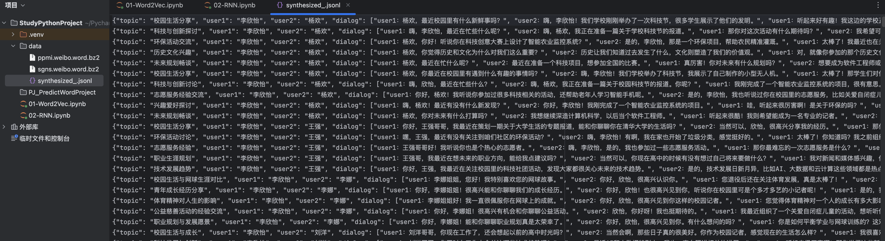

# 传统序列 模型

---

## 一、RNN

在自然语言中，词语的顺序对于理解句子的含义至关重要。虽然词向量能够表示词语的语义，但它本身并不包含词语之间的顺序信息。

为了解决这一问题，研究者提出RNN（Recurrent Neural Network，循环神经网络）。
RNN 会逐个读取句子中的词语，并在每一步结合当前词和前面的上下文信息，不断更新对句子的理解。通过这种机制，RNN 能够持续建模上下文，从而更准确地把握句子的整体语义。因此RNN曾是序列建模领域的主流模型，被广泛应用于各类NLP任务。

说明：

随着技术的发展，RNN已经逐渐被结构更灵活、计算效率更高的Transformer 模型所取代，后者已经成为当前自然语言处理的主流方法。
尽管如此，RNN 仍然具有重要的学习价值。它所体现的“循环建模上下文”的思想，不仅为 LSTM 和 GRU 等改进模型奠定了基础，也有助于我们更好地理解 Transformer 等更复杂的架构。

### 1.RNN 结构

RNN（循环神经网络）的核心结构是一个具有循环连接的隐藏层，它以时间步（time step）为单位，依次处理输入序列中的每个 token。
在每个时间步，RNN 接收当前 token 的向量和上一个时间步的隐藏状态（即隐藏层的输出），计算并生成新的隐藏状态，并将其传递到下一时间步。

#### (1) RNN 基础结构


#### (2) RNN 多层结构


#### (3) RNN 双向结构


#### (4) RNN 多层双向结构


---

### 2.RNN API

```python
from torch import nn

rnn = nn.RNN()
```


---

### 3.RNN 案例

数据集：https://huggingface.co/datasets/Jax-dan/HundredCV-Chat


PS：使用HuggingFace提供的API直接使用数据集：

```python
from datasets import load_dataset

ds = load_dataset("Jax-dan/HundredCV-Chat")
```

:::info

数据集的文件后缀是 `.jsonl` ，表示这个文件中的数据一行为一个JSON字符串



:::

项目结构：

<div align="center">


</div>

#### (1) 数据预处理

Pandas 如何读写JSON文件？

https://pandas.pydata.org/docs/user_guide/io.html#writing-json

https://pandas.pydata.org/docs/user_guide/io.html#io-json-reader


```shell
pip3 install -i https://pypi.tuna.tsinghua.edu.cn/simple scikit-learn
```

```shell
pip3 install -i https://pypi.tuna.tsinghua.edu.cn/simple jieba       
```

---

### 4.RNN 存在的问题

尽管循环神经网络（RNN）在处理序列数据方面具有天然优势，但它在实际应用中面临一个非常严重的问题：长期依赖建模困难。这指的是：在训练过程中，当输入序列很长时，模型难以有效学习早期输入对最终输出的影响。


上述问题的根本原因在于训练过程中存在的梯度消失或梯度爆炸问题。

在训练RNN时，采用的是时间反向传播（Backpropagation Through Time, BPTT）方法，在反向传播过程中，梯度需要在每个时间步上不断链式传递，下图为RNN在训练过程中的计算图


PS：多元复合函数求导法则


---

## 二、LSTM

为了缓解RNN梯度消失或者梯度爆炸的问题，Hochreiter 和 Schmidhuber 于 1997 年提出了长短期记忆网络（Long Short-Term Memory, LSTM）。

### 1.LSTM 结构

#### (1) 基础结构

LSTM 通过引入特殊的记忆单元（Memory Cell，图中的），有效提升了模型对长序列依赖关系的建模能力。其沿时间步展开后的结构如下图所示：


**记忆单元（Memory Cell）：**

记忆单元负责在序列中长期保存关键信息。它相当于一条“信息通道”，在多个时间步之间直接传递信息（记忆单元是缓解梯度消失和梯度爆炸问题的核心），如下图中的 Ct-1 -> Ct。

**遗忘门（Forget Gate）**


**输入门（Input Gate）**

输入门控制要从当前时间步的输入向记忆单元存入多少新的信息。例如上述案例中，当前时间步的输入为“小美”，所以此时记忆单元就应该存入新的主语信息“小美”。

当前时间步的信息由当前输入和上一个隐藏状态计算而成，同时输入门也由当前输入和上一个隐藏状态计算而成，然后新的信息和输入门相乘得到需要存入记忆单元的信息

**输出门（Output Gate）**

输出门控制从记忆单元中读取多少信息作为当前时间步的隐藏状态进行输出。例如上述输入法智能提示案例中，记忆单元中存入新主语信息“小美”之后，当前时间步就应该从记忆单元中提取该主语信息，生成与“小美”相关的内容。


#### (2) 多层结构


### 2.LSTM API


### 3.LSTM 案例


---

## 三、GRU

Gated Recurrent Unit（GRU）是为了进一步简化 LSTM 结构、降低计算成本而提出的一种变体。GRU 保留了门控机制的核心思想，但相比 LSTM，结构更为简洁，参数更少，训练效率更高。

在许多实际任务中，GRU 能在保持类似性能的同时，显著减少训练时间。

### 1.GRU 结构

#### (1) 基础结构

**重置门（Reset Gate）**


**更新门（Update Gate）**


---

