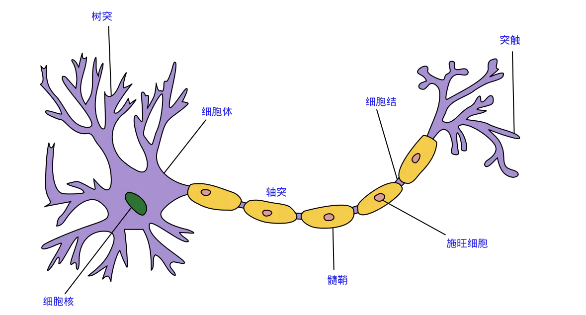
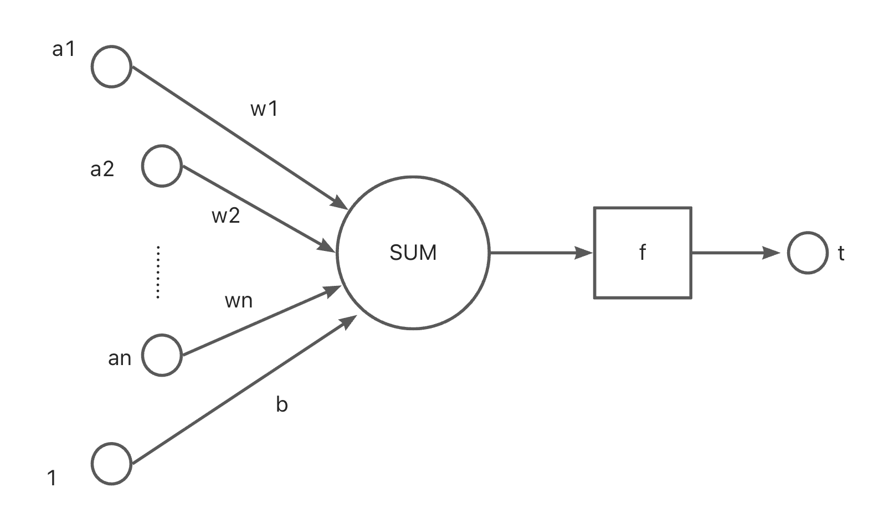
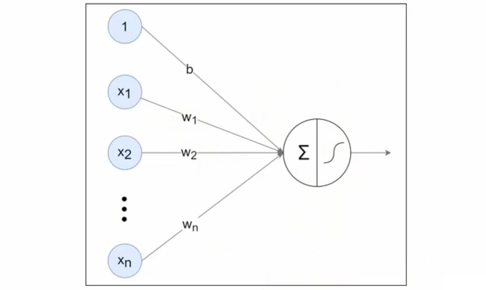
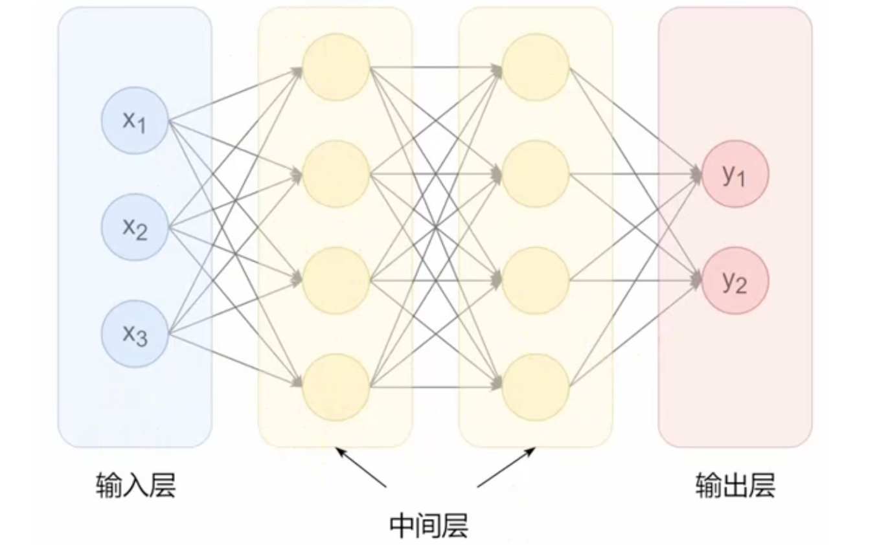
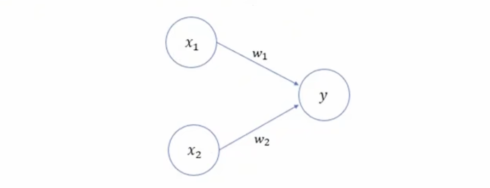
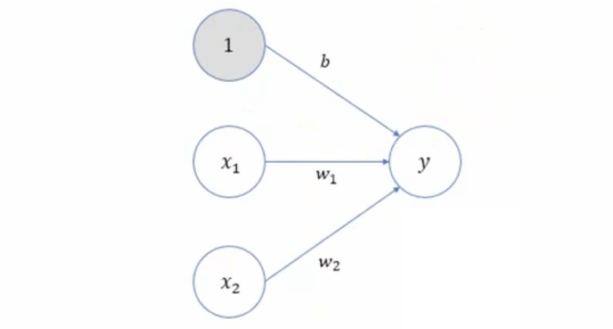
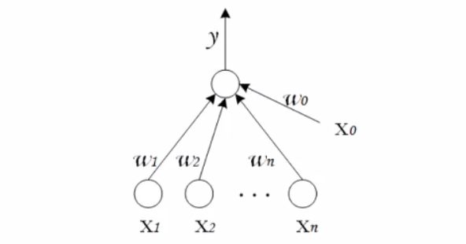

# 神经网络基础

---

## 一、神经网络构成

在生物神经网络中，每个神经元与其它神经元相连，当它'兴奋"时，就会向相连的神经元发送化学物质，从而改变这些神经元内的电位；如果某神经元的电位超过了一个"阈值"，那么他就会被激活，即"兴奋"起来，向其它神经元发送化学物质。

1943年，McCulloch和Pitts将上述情景抽象为如图所示的简单模型，这就是一直沿用至今的**M-P神经元模型**。把许多这样的神经元按一定层次结构连接起来，就得到了神经网络。

**其中：**

- a1，a2.........an为各个输入的分量
- w1，w2.......wn为各个输入分量对应的权重参数
- b 为偏置
- f 为激活函数，常见的激活函数有tanh，sigmoid，relu
- t 为神经网络输出

使用数学公式表示就是：

可见，一个神经元的功能是求得输入向量与权向量的内积后，经一个非线性传递函数得到一个标量结果。

### 1.神经网络基本概念和结构

人工神经网络（ArtificialNeuralNetwork，ANN）简称神经网络（NN），是一种模仿生物神经网络结构和功能的计算模型。大多数情况下人工神经网络能在外界信息的基础上改变内部结构，是一种自适应系统(adaptive system)，通俗地讲就是具备学习功能。

人工神经网络中的神经元，一般可以对多个输入进行加权求和，再经过特定的“激活函数”转换后输出。

使用多个神经元就可以构建多层神经网络，最左边的一列神经元都表示输入，称为输入层；最右边一列表示网络的输出，称为输出层；输入层与输出层之间的层统称为中间层（隐藏层）。

相邻层的神经元相互连接（图中下一层每个神经元都与上一层所有神经元连接，称为全连接），每个连接都会有一个权重。

神经元中的信息逐层传递（一般称为前向传播forward），上一层神经元的输出作为下一层神经元的输入。

### 2.感知机

我们先复习一下在机器学习部分学习过的感知机。感知机（Perceptron）是二分类模型，接收多个信号，输出一个信号。感知机的信号只有 0、1两种取值。下图是一个接收两个输入信号的感知机的例子：

x1,x2是输入信号，y是输出信号，W，W2是权重，O称为神经元或节点。输入信号被送往神经元时，会分别乘以固定的权重。神经元会计算传送过来的信号的总和，只有当这个总和超过某个界限值时才会输出1，也称之为神经元被激活。

这里将界限的阈值设为0。除了权重w可以增加一个参数b，被称为偏置。

感知机的多个输入信号都有各自的权重，这些权重发挥着控制各个信号的重要性的作用，权重越大，对应信号的重要性越高。偏置则可以用来控制神经元被激活的容易程度。

>  常见的两层神经网络-感知机

感知机是由两层神经网络组成，输出层接收外界输入信号后传递给输出层（输出+1正例，-1反例），输出层是M-P神经元。

其中从`W0，W1.........Wn`都表示权重。

---

### 3.激活函数

## 二、激活函数

## 三、神经网络实现

## 四、
