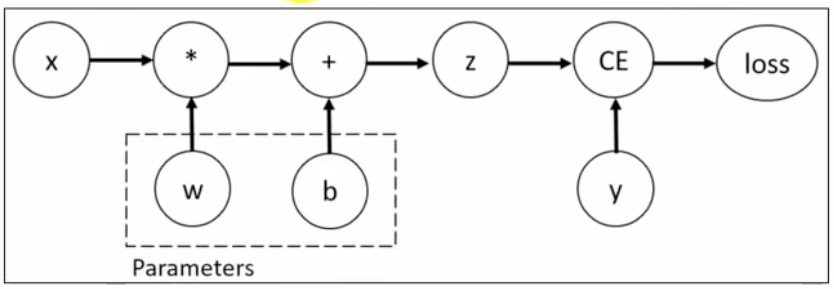

#  Pytorch 自动微分

---

## 一、梯度计算

训练神经网络时，框架会根据设计好的模型构建一个计算图（`computational graph`），来跟踪计算是哪些数据通过哪些操作组合起来产生输出，并通过反向传播算法来根据给定参数的损失函数的梯度调整参数（模型权重）。

`PyTorch`具有一个内置的微分引擎`torch.autograd`以支持计算图的梯度自动计算。考虑最简单的单层神经网络，具有输入`x`、参数`w`、偏置`b`以及损失函数：



```python
import torch

x = torch.tensor([[10.0]])
y = torch.tensor([[3.0]])

print(f"x = {x}, y = {y}")

# 初始化超参数
w = torch.rand(1, 1, requires_grad=True)
b = torch.rand(1, 1, requires_grad=True)
print(f"w = {w}, b = {b}")

# 计算前向传播得到输出值
z = w * x + b
print(f"z = {z}")

# 设置损失函数（均方损失函数）
loss = torch.nn.MSELoss()
loss_value = loss(z, y)
print(f"loss_value = {loss_value}")

# 反向传播
loss_value.backward()

# 查看梯度数据
print(f"w.grad = {w.grad}")
print(f"b.grad = {b.grad}")
```

该计算图中x、w、b为叶子节点，即最基础的节点。叶子节点的数据并非由计算生成，因此是整个计算图的基石，叶子节点张量不可以执行in-place操作（就地操作、原地操作），而最终的loss为根节点。

**PS：损失值一定是一个标量值对应的张量，然后才能调用`backward()`方法。**

可通过is_leaf属性查看张量是否为叶子节点：

```python
# 判断节点是否是一个叶子节点
print(f"x is leaf: {x.is_leaf}")
print(f"z is leaf: {z.is_leaf}")
```

自动微分的关键就是记录节点的数据与运算。数据记录在张量的`data`属性中，计算记录在张量的`grad_fn`属性中。

计算图根据搭建方式可分为静态图和动态图，PyTorch是动态图机制，在计算的过程中逐步搭建计算图，同时对每个Tensor都存储grad_fn供自动微分使用。

若设置张量参数`requires_grad=True`，则PyTorch会追踪所有基于该张量的操作，并在反向传播时计算其梯度。依赖于叶子节点的节点，`requires_grad`默认为`True`。当计算到根节点后，在根节点调用`backward()`方法即可反向传播计算计算图中所有节点的梯度。

非叶子节点的梯度在反向传播之后会被释放掉（除非设置参数`retain_grad=True`）。而叶子节点的梯度在反向传播之后会保留（累积）。通常需要使用`optimizer.zero_grad()`清零参数的梯度。

有时我们希望将某些计算移动到计算图之外，可以使用`Tensor.detach()`返回一个新的变量，该变量与原变量具有相同的值，但丢失计算图中如何计算原变量的信息。换句话说，梯度不会在该变量处继续向下传播。例如：

```python
tensor_data = torch.tensor([[10.0]], requires_grad=True)

# 使用detach分离计算图中的节点
tensor_detach = tensor_data.detach()

print(f"tensor_data = {tensor_data}, requires_grad = {tensor_data.requires_grad}, id = {id(tensor_data)}")
print(f"tensor_detach = {tensor_detach}, requires_grad = {tensor_detach.requires_grad}, id = {id(tensor_detach)}")

# 查看数据存储指针，底层数据共享
print(f"untyped storage: {tensor_data.untyped_storage().data_ptr()}, {tensor_detach.untyped_storage().data_ptr()}")
```


---

## 线性回归

通过PyTorch训练一个模型一般分为以下4个步骤：

```
准备数据→构理模型→定义损失函数与优化器→模型训练
```

PyTorch 实现线性回归：

```python
```

