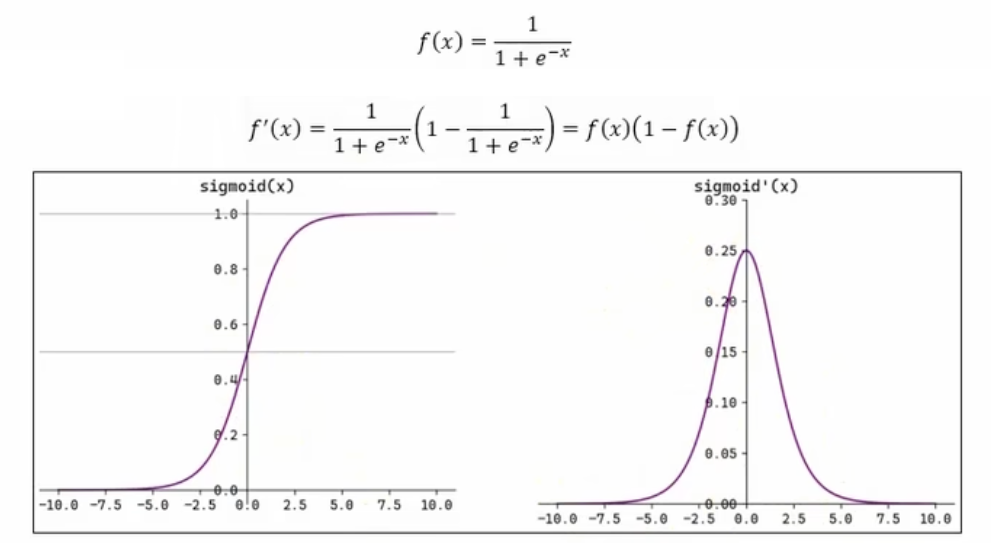
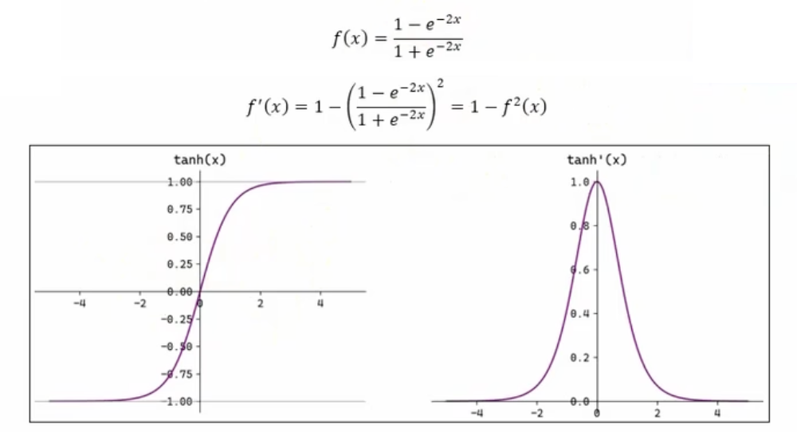

# Pytorch 激活函数

---

PyTorch中已经实现了神经网络中可能用到的各种激活函数，我们在代码中只要直接调用即可。

## 一、Sigmoid 激活函数

Sigmoid函数将输入映射到0到1之间，常用于二分类任务的输出层。

---

## 二、Tanh 函数

双曲正切函数（Tanh）将输入映射到-1到1之间，常用于隐藏层。

---

## 三、Relu 函数

ReLU（Rectified Linear Unit）函数在输入大于0时输出输入值，否则输出0，是目前最常用的激活函数。

注意：x=0时，ReLU函数的导数是不可导的，但在实际应用中通常将其定义为0或1。

---

## 四、Softmax 函数

Softmax函数将输入向量转换为概率分布，常用于多分类任务的输出层。

