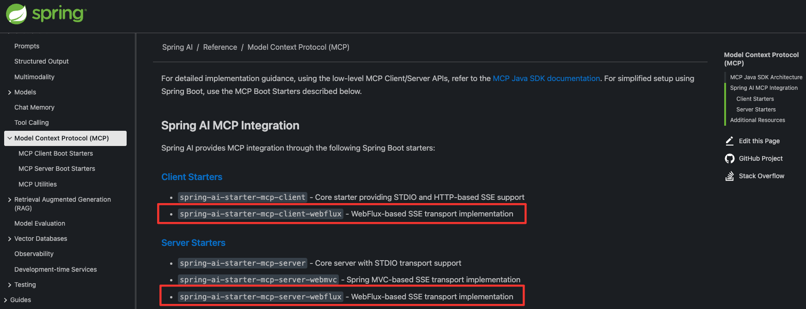
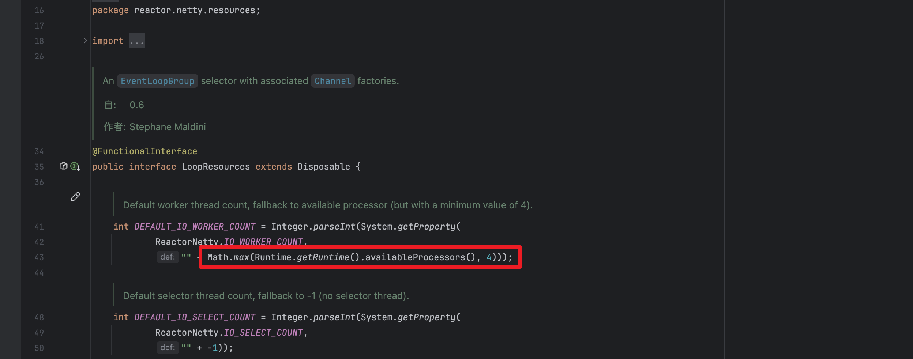

# Netty Http 服务器请求阻塞

---

项目背景是我们团队在一个内部服务系统中落地了一个大模型的应用场景（下文中中表述为："对话生成场景"）。在技术选型阶段，我们考虑使用了MCP。
同时，这个场景在端到端的对话时延上有一定的要求，因此在请求模型后不能一直等待模型全部推理完成后在进行返回。
我们选择使用 SSE 进行流失输出，模型每返回一个 token 就通过 SSE 发送给上游服务，这样能有效降低在使用体验上的等待感。

最终，我们选择使用 Spring AI WebFlux 来实现这个场景。Spring AI WebFlux 是基于 Spring WebFlux 的一个扩展，专门用于处理 AI 模型的请求和响应。
Spring WebFlux 与 Spring MVC 不同，它是基于响应式编程模型的，能够更好地处理高并发和异步请求。背后依赖于 Netty 作为底层的 HTTP 服务器。

Spring AI：https://spring.io/projects/spring-ai#overview



当初考虑到 Netty 的高性能和非阻塞特性，我们采用了异步回推的方式来处理模型的响应。
当上游服务发起请求时，首先将请进行封装放入内存队列中，然后立即返回一个响应，下游实时轮询内存队列异步处理请求（基于生产者消费者模式）。

起初在实验阶段，上游并发在10以内，服务稳定没有出现问题。后续又在这个模块服务上新增了其他场景的支持后，我们发现【对话生成场景】上游系统开始频繁报HTTP请求超时。

我们开始着手排查问题。

首先，我们确认上游服务的请求超时时间配置的3秒，我们的服务系统没有耗时操作，不至于请求后3秒内没有响应。
排除了网络抖动，服务宕机导致的请求超时（因为是部分请求超时，部分氢请求正常，且流量是均分到每一台机器上，每一台服务都有这样的情况）。

接着，我们根据上游服务系统提供的 request log id 进行日志检索，发现了一个有趣的现象：
这些请求中在我们服务系统中有些请求没有任何日志输出，说明这些请求根本没有到达我们的服务系统。有部分请求在发起请求后，延迟一分多钟才有日志输出。

这时我们怀疑是 Netty 服务器在处理请求时出现了问题。于是开始对 Netty 的配置进行排查。由于我们使用的是 Spring WebFlux 默认配置，没有对 底层的 Netty 进行任何优化。

初步认定是 Netty 的线程模型可能存在问题。Netty 使用了 Reactor 线程模型，分为 Boss 线程和 Worker 线程。 Boss 线程负责接收连接，Worker 线程负责处理 I/O 操作。
我们怀疑在高并发情况下，Worker 线程可能会被阻塞，导致无法及时处理新的请求。

> PS：这里为什么没有对服务的性能进行压测就上线呢？主要是因为当初在技术选型阶段，我们对 Spring WebFlux 和 Netty 的性能有一定的了解，认为其能够满足我们的需求。
> 
> 最重要的是：项目时间紧迫，我们没有足够的时间进行全面的性能测试。😭（倒排需求......）

接着，开始对 Netty 的线程模型进行配置。

第一次尝试重新注入 `WebServerFactoryCustomizer` ，但是从执行结果来看，这个配置没有生效：

```java
@Bean
public WebServerFactoryCustomizer<NettyReactiveWebServerFactory> nettyFactoryCustomizer() {
    NettyRuntime.setAvailableProcessors(96);
    return factory -> factory.addServerCustomizers(
            httpServer -> {
                LoopResources loopResources = LoopResources.create("agent-event-loop", 8, 256, true);
                return httpServer.runOn(loopResources);
            });
}
```

为什么没有生效：

`WebServerFactoryCustomizer`  里用  `httpServer.runOn(loopResources)` **并没有改“全局”的 Reactor Netty 线程池** ，只会给“这个 HttpServer 实例”换一套  `LoopResources` ；而应用里依然会存在默认的全局线程池（线程名通常是  `reactor-http-*` ），所以数到的“worker 线程数”看起来没变，以为失败了。Reactor Netty 官方文档也说明：默认是共享一套全局 EventLoop，若需不同配置需显式用 `LoopResources#create`/`runOn `，它只影响该 server。


**Spring Boot 服务器创建流程：**

 `NettyReactiveWebServerFactory` 在构建 `HttpServer` 时，如果存在 `ReactorResourceFactory` 会先调用 `runOn(resourceFactory.getLoopResources())` 让服务器使用它管理的 `LoopResources`，然后再应用自定义器（`addServerCustomizers(...)`）。因此：

- 用自定义器 `runOn(...)` 的确能给 **服务器**换一套 loops；
- 但这**不会**改掉**全局**的 `reactor-http-*` 线程池（客户端/WebClient 等还在用全局池）。

**Reactor Netty 全局线程池：**

默认共享一套全局 EventLoop，工作线程数=启动时可用 CPU 数（至少 4）。可通过系统属性 `reactor.netty.ioWorkerCount` / `reactor.netty.ioSelectCount` 在**第一次初始化**时决定线程数。

**`LoopResources#create(...)` 只影响被 `runOn(...)` 的实例**，不会触碰全局资源；


Netty 默认是获取当前物理机的 CPU 核数 * 2作为 Worker 线程数。如果需要自定义配置的话需要重写 Netty 对于 Worker 线程数的配置。

`reactor.netty.resources.LoopResources` 中定义了默认的 Netty 工作线程数：



`reactor.netty.ReactorNetty` 中定义了【Netty 全局配置】默认值：

```java
/**
 * Default worker thread count, fallback to available processor
 * (but with a minimum value of 4).
 */
public static final String IO_WORKER_COUNT = "reactor.netty.ioWorkerCount";

/**
 * Default selector thread count, fallback to -1 (no selector thread)
 * <p><strong>Note:</strong> In most use cases using a worker thread also as a selector thread works well.
 * A possible use case for specifying a separate selector thread might be when the worker threads are too busy
 * and connections cannot be accepted fast enough.
 * <p><strong>Note:</strong> Although more than 1 can be configured as a selector thread count, in reality
 * only 1 thread will be used as a selector thread.
 */
public static final String IO_SELECT_COUNT = "reactor.netty.ioSelectCount";
```


直接配置 `reactor.netty.ioWorkerCount` 和 `reactor.netty.ioSelectCount` 两个配置项，重启服务，配置生效，修改成功！

```java
@Bean
public ReactorResourceFactory reactorClientResourceFactory() {
    System.setProperty("reactor.netty.ioSelectCount", "1");

    // 这里工作线程数为2-4倍都可以。看具体情况
    int ioWorkerCount = Math.max(Runtime.getRuntime().availableProcessors() * 3, 24);
    System.setProperty("reactor.netty.ioWorkerCount", String.valueOf(ioWorkerCount));
    return new ReactorResourceFactory();
}
```


`ReactorResourceFactory` + 设置 `reactor.netty.ioWorkerCount`/`ioSelectCount`）之所以**生效**，是因为 Spring Boot 默认让 WebFlux 服务器**使用 `ReactorResourceFactory` 管理的资源**；而 Reactor Netty 会在**首次初始化全局资源时**读取这些系统属性来决定线程数，所以你把属性提前设好，就改变了全局线程池（于是你看到 `reactor-http-*` 的线程数变化）

第一个 Bean 里调用的 `NettyRuntime.setAvailableProcessors(96)`基本不起作用：Netty 要求**在任何 Netty 组件首次初始化之前**设置可用核数，否则会被忽略/抛异常；在 Spring Boot 的生命周期里，这一步通常已经太晚。


**如果你想全局统一改（服务器 + WebClient 都用同一套线程池）**，推荐用 Boot 官方的资源工厂来托管：

```java
@Bean
public ReactorResourceFactory reactorResourceFactory() {
    ReactorResourceFactory r = new ReactorResourceFactory();
    r.setUseGlobalResources(false); // 不使用 Reactor 的全局资源
    r.setLoopResourcesSupplier(() -> LoopResources.create("agent-event-loop", 8, 256, true));
    return r;
}
```

> 说明：`setUseGlobalResources(false)` + `setLoopResourcesSupplier(...)` 是 Spring Framework 提供的官方扩展点，用来自定义并托管 `LoopResources`，这时服务器和基于该工厂创建的客户端都会走你配置的线程池。


使用 Jmeter 进行压测，首先观察 Worker 线程数是否增加。


进行线程 dump，查看线程数据量：


