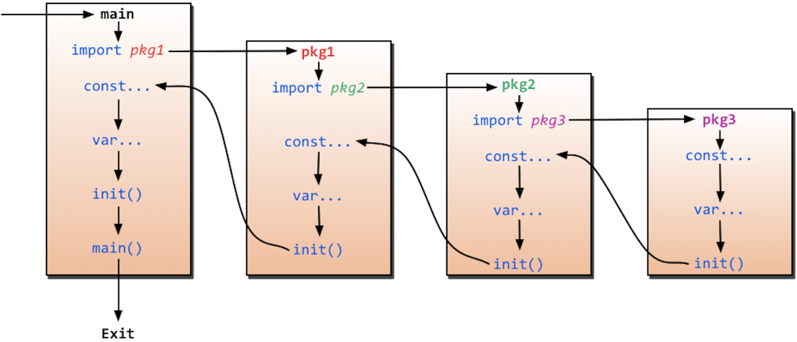

# Golang 基础语法

---

## 一、从Main方法快速开始

定义一个 `main` 方法：

```golang
package main // 设置当前程序的包名

//import "fmt"
import (
	"fmt"
	"time"
)

// 定义main函数
func main() {
	// golang中的表达式，加分号和不加分号都可以，建议是不加分号
	fmt.Println("Hello World")

	time.Sleep(1 * time.Second)
}
```

- 第一行代码package main定义了包名。你必须在源文件中非注释的第一行指明这个文件属于哪个包，如：package main。package main表示一个可独立执行的程序，每个 Go 应用程序都包含一个名为 main 的包。
- 下一行import "fmt"告诉 Go 编译器这个程序需要使用 fmt 包（的函数，或其他元素），fmt 包实现了格式化 IO（输入/输出）的函数。
- 下一行func main()是程序开始执行的函数。main 函数是每一个可执行程序所必须包含的，一般来说都是在启动后第一个执行的函数（如果有 init() 函数则会先执行该函数）。

> ⚠️ 注意：这里面go语言的语法，定义函数的时候，`{` 必须和函数名在同一行，不能另起一行。

- 下一行 /.../ 是注释，在程序执行时将被忽略。单行注释是最常见的注释形式，你可以在任何地方使用以 // 开头的单行注释。多行注释也叫块注释，均已以 / 开头，并以 / 结尾，且不可以嵌套使用，多行注释一般用于包的文档描述或注释成块的代码片段。
- 下一行fmt.Println(...)可以将字符串输出到控制台，并在最后自动增加换行字符 \n。 使用 fmt.Print("hello, world\n") 可以得到相同的结果。 Print 和 Println 这两个函数也支持使用变量，如：fmt.Println(arr)。如果没有特别指定，它们会以默认的打印格式将变量 arr 输出到控制台。

使用终端执行：

```shell
go run firstMain.go 
```

`go run` 表示 直接编译go语言并执行应用程序，一步完成。也可以先编译，然后再执行：

```shell
# 执行编译
go build firstMain.go

# 编译完成之后是一个二进制可执行文件，直接执行
./firstMain
```

---

## 二、变量声明

### 1.普通变量声明

声明变量的一般形式是使用 var 关键字

```golang
package main

import "fmt"

func main() {
	// 方式一：声明变量不进行初始化，默认值
	var number int
	fmt.Println("Number is", number)

	// 方式二：根据值自行判定变量类型
	var str = "String Value"
	fmt.Println("String is", str)

	// 方法三：省略var关键字，使用:=进行变量类型推导（PS：不支持全局变量声明）
	data := "this is a data without var"
	fmt.Println("data is", data)
}
```

---

### 2.常量声明

常量是一个简单值的标识符，在程序运行时，不会被修改的量。常量中的数据类型只可以是布尔型、数字型（整数型、浮点型和复数）和字符串型。

```golang
const identifier [type] = value
```


#### iota 优雅常量

> PS：实际开发过程中很少使用

iota可以做更多事情，而不仅仅是 increment。更精确地说，iota总是用于 increment，但是它可以用于表达式，在常量中的存储结果值。

```golang
const (
    CategoryBooks = iota // 0
    CategoryHealth       // 1
    CategoryClothing     // 2
)
```

---

## 三、函数声明

### 1.函数声明

Go 函数可以返回多个值：

```golang
package main

import "fmt"

// 定义函数
func function(param string) string {
	fmt.Println("Function called with param", param)
	return param
}

// Golang中的函数支持返回多个值
func multiBackFunc(param string) (string, string) {
	fmt.Println("param is", param)
	return "first return param", "second return param"
}

func main() {
	data := function("this is a data without var")
	fmt.Println("data is", data)

	returnData1, returnData2 := multiBackFunc("this is a data for multi back func")
	fmt.Println("returnData1 is", returnData1)
	fmt.Println("returnData2 is", returnData2)
}
```

### 2.init函数与main函数

golang里面有两个保留的函数：init函数（能够应用于所有的package）和main函数（只能应用于package main）。这两个函数在定义时不能有任何的参数和返回值。

init 函数可在package main中，可在其他package中，可在同一个package中出现多次。main 函数只能在package main中。虽然一个package里面可以写任意多个init函数，但这无论是对于可读性还是以后的可维护性来说，我们都强烈建议用户在一个package中每个文件只写一个init函数。

go程序会自动调用init()和main()，所以你不需要在任何地方调用这两个函数。每个package中的init函数都是可选的，但package main就必须包含一个main函数。程序的初始化和执行都起始于main包。
如果main包还导入了其它的包，那么就会在编译时将它们依次导入。有时一个包会被多个包同时导入，那么它只会被导入一次（例如很多包可能都会用到fmt包，但它只会被导入一次，因为没有必要导入多次）。

<div align="center">


</div>

当一个包被导入时，如果该包还导入了其它的包，那么会先将其它包导入进来，然后再对这些包中的包级常量和变量进行初始化，接着执行init函数（如果有的话），依次类推。
等所有被导入的包都加载完毕了，就会开始对main包中的包级常量和变量进行初始化，然后执行main包中的init函数（如果存在的话），最后执行main函数。下图详细地解释了整个执行过程：



### 3.函数参数

函数如果使用参数，该变量可称为函数的形参。形参就像定义在函数体内的局部变量。调用函数，可以通过两种方式来传递参数：

#### 值传递

值传递是指在调用函数时将实际参数复制一份传递到函数中，这样在函数中如果对参数进行修改，将不会影响到实际参数。默认情况下，Go 语言使用的是值传递，即在调用过程中不会影响到实际参数。


#### 指针传递（引用传递）

变量是一种使用方便的占位符，用于引用计算机内存地址。Go 语言的取地址符是 &，放到一个变量前使用就会返回相应变量的内存地址。

指针传递是指在调用函数时将实际参数的地址传递到函数中，那么在函数中对参数（指针指向的内存地址中存储的数据）所进行的修改，将影响到实际参数。

---

## 四、defer 延迟执行

Go 中 defer 和 return 执行的先后顺序：

- 多个defer的执行顺序为“后进先出”
- defer、return、返回值三者的执行逻辑应该是：return最先执行，return负责将结果写入返回值中；接着defer开始执行一些收尾工作；最后函数携带当前返回值退出。

如果函数的返回值是无名的（不带命名返回值），则go语言会在执行return的时候会执行一个类似创建一个临时变量作为保存return值的动作。

```golang
package main
 
import "fmt"
 
func main() {
    fmt.Println("return:", test())  // defer 和 return之间的顺序是先返回值, i=0，后defer
}
 
func test() int {//这里返回值没有命名
    var i int
    defer func() {
        i++
        fmt.Println("defer1", i) //作为闭包引用的话，则会在defer函数执行时根据整个上下文确定当前的值。i=2
    }()
    defer func() {
        i++
        fmt.Println("defer2", i) //作为闭包引用的话，则会在defer函数执行时根据整个上下文确定当前的值。i=1
    }()
    return i
}　
```

而有名返回值的函数，由于返回值在函数定义的时候已经将该变量进行定义，在执行return的时候会先执行返回值保存操作，而后续的defer函数会改变这个返回值(虽然defer是在return之后执行的，但是由于使用的函数定义的变量，所以执行defer操作后对该变量的修改会影响到return的值。

```golang
package main
 
import "fmt"
 
func main() {
    fmt.Println("return:", test())
}
 
func test() (i int) { //返回值命名i
    defer func() {
        i++
        fmt.Println("defer1", i)
    }()
    defer func() {
        i++
        fmt.Println("defer2", i)
    }()
    return i
}
```

return 返回值的运行机制：return 并非原子操作，分为赋值，和返回值两步操作。defer 执行时机是在赋值之后，返回之前。

---


## 五、slice 和 map 集合

Go 数组的长度不可改变，在特定场景中这样的集合就不太适用，Go中提供了一种灵活，功能强悍的内置类型切片("动态数组"),与数组相比切片的长度是不固定的，可以追加元素，在追加时可能使切片的容量增大。


## 六、Golang 面向对象特征


### 结构体标签


## 七、interface 接口


## 八、反射和范型


